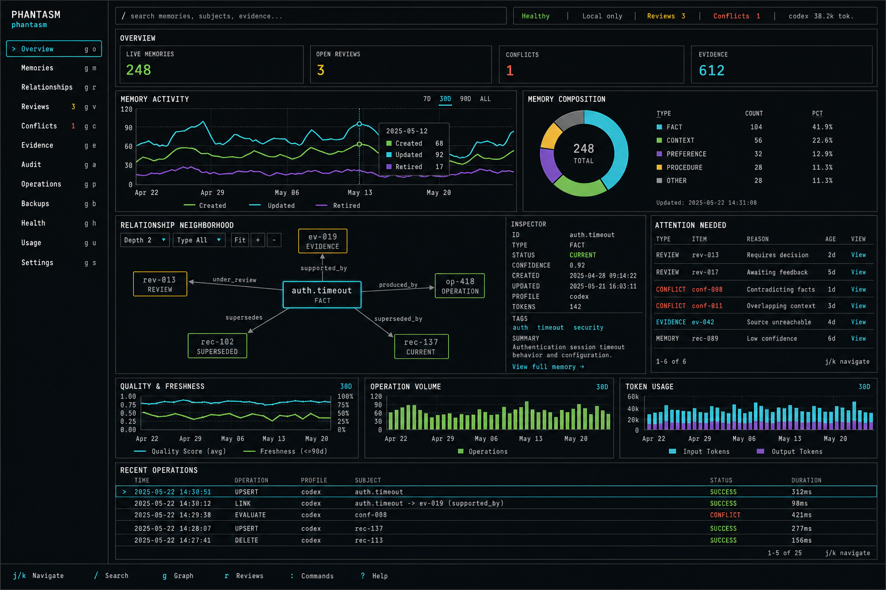

# Phantasm Dashboard Design

Status: approved for implementation on 2026-07-12.

## Direction

The dashboard is a local, project-scoped systems console rather than a
generic administration application. It uses a disciplined terminal-inspired
visual language while retaining web-quality charts, relationship exploration,
responsive layout, pointer interaction, and keyboard navigation.

- Near-black surfaces with thin square borders and no CRT effects.
- Monospace identifiers and compact uppercase section labels.
- Cyan for focus and selection, green for healthy/live, amber for review and
  freshness warnings, and red only for conflicts and errors.
- Dense information hierarchy with inline inspectors; no modal CRUD flows.
- Domain language only: ingest, revise, archive, review, evidence, conflict,
  operation, and relationship. Never use generic database actions such as
  upsert or delete in the interface.
- Every interactive chart and graph has an equivalent accessible table or
  textual summary and complete keyboard access.

The image is a visual reference, not a data contract. All displayed values
must come from the current project's Phantasm runtime, and unavailable token
usage must be labeled as unreported rather than inferred.
